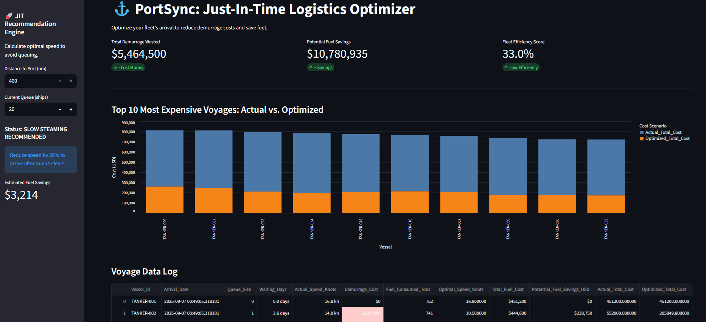

# ⚓ PortSync: Just-In-Time Logistics Optimizer

> **Система оптимизации морской логистики (Downstream).**
> *Сокращаем штрафы за простой (Demurrage) и выбросы CO2 за счет алгоритмов "умного прибытия" (Just-In-Time Arrival).*

---

## 📉 Проблема (The Pain)

В морской нефтеперевозке существует парадокс: танкеры спешат в порт на полной скорости, чтобы... встать в очередь на якорь.
* **Финансовые потери:** Простой танкера стоит **$30,000 - $80,000 в сутки** (Demurrage fees).
* **Экологические потери:** Высокая скорость (14+ узлов) сжигает на 20-30% больше топлива, чем экономичный ход, создавая лишние выбросы CO2.

Портовые заторы (Port Congestion) стоят индустрии миллиарды, так как капитаны не видят ситуацию с очередью в реальном времени.

## 💡 Решение (The Solution)

**PortSync** — это система поддержки принятия решений (DSS), реализующая концепцию **Just-In-Time (JIT) Arrival**.

Алгоритм анализирует текущую очередь в терминале и рассчитывает **Оптимальную Скорость Подхода (Optimal Approach Speed)**.
Вместо того чтобы приплыть быстро и ждать 3 дня, судно снижает скорость (Slow Steaming), экономит топливо и прибывает ровно к моменту освобождения причала.

---

## 🚀 Ключевой Функционал

### 1. Demurrage Risk Analyzer
Дэшборд мониторит флот и подсвечивает рейсы с высоким риском простоя.
* **Метрика:** Total Demurrage Wasted (Потерянные деньги).
* **Визуализация:** Сравнение фактических затрат vs. оптимизированных (Before/After).

### 2. Speed Recommendation Engine (Sidebar)
Интерактивный калькулятор для капитана/оператора:
* **Ввод:** Расстояние до порта (nm) + Размер очереди (судов).
* **Вывод:** Рекомендуемая скорость (узлы).
* **Экономика:** Мгновенный расчет сэкономленных денег на топливе.

### 3. Fleet Efficiency Scoring
Оценка эффективности логистики на основе исторических данных: какой процент рейсов был выполнен по JIT-модели.

---

## 📊 Бизнес-Логика (Unit Economics)

Система моделирует два сценария для каждого рейса:

| Сценарий | Скорость | Время в пути | Ожидание на рейде | Расход топлива | Штраф (Demurrage) | ИТОГО ЗАТРАТЫ |
| :--- | :--- | :--- | :--- | :--- | :--- | :--- |
| **A. "Rush to Wait" (Стандарт)** | 14 узлов (Fast) | 3 дня | **2 дня** | Высокий (800t) | **$60,000** | 🔴 **$$$$$** |
| **B. "PortSync JIT" (Оптимизация)** | 10 узлов (Slow) | 5 дней | **0 дней** | Низкий (650t) | **$0** | 🟢 **$$** |

**Результат:** PortSync превращает время ожидания (Loss) в время медленного хода (Savings).

---

## 🛠 Технический стек

* **Core:** Python 3.9
* **Data Simulation:** Pandas (Logistics modeling based on Queue Theory).
* **Visualization:** Altair & Streamlit (Interactive charts).
* **Business Logic:** Расчет расхода топлива основан на кубической зависимости мощности от скорости (Propeller Law).

---

## 📦 Как запустить

1. Клонируйте репозиторий:
git clone [https://github.com/pogos-akopian/PortSync.git](https://github.com/pogos-akopian/PortSync.git)

2. Установите зависимости:
pip install -r requirements.txt

3. Сгенерируйте данные порта (симуляция трафика):
python generate_port_data.py

4. Запустите приложение:
streamlit run app.py
